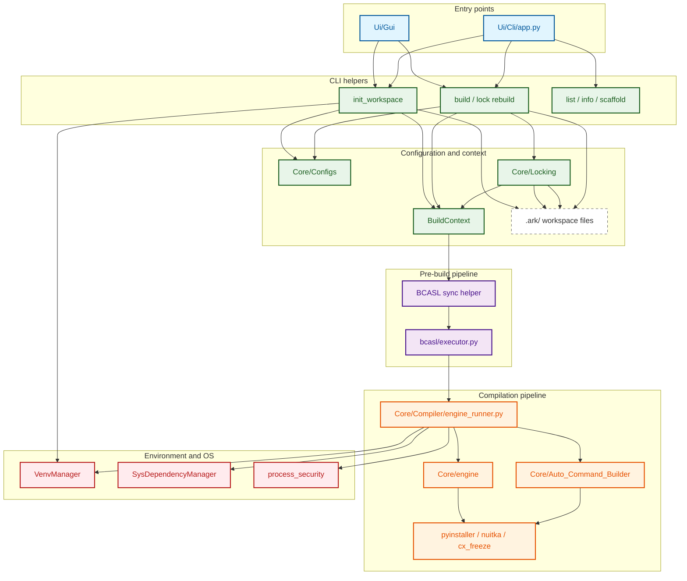

<p align="center">
  
</p>

<p align="center">
  <a href="https://pypi.org/project/pycompiler-ark/"></a>
  <a href="LICENSE"></a>
  <a href="https://www.python.org/"></a>
  <a href="https://github.com/raidos23/PyCompiler_ARK/stargazers"></a>
</p>

# **PyCompiler ARK**

A Python project build workshop with a Qt GUI, a headless-friendly CLI, a pre-compilation pipeline, and a multi-engine system.

---

## Why this app?

Build Python apps with a predictable workflow, a configurable pre-compile pipeline, and the freedom to choose your build engine.

## Comparison with auto-py-to-exe

| Feature                        | auto-py-to-exe      | PyCompiler ARK                  |
|--------------------------------|---------------------|---------------------------------|
| GUI packaging workflow         | ✅                  | ✅                              |
| Full CLI support               | Limited             | ✅                              |
| CI/CD & automation             | Limited             | ✅ JSON output & scripting      |
| Multiple build engines         | ❌ PyInstaller only | ✅ PyInstaller, Nuitka, cx_Freeze |
| Pre-build pipeline             | ❌                  | ✅ BCASL                        |
| Plugin / extensibility system  | ❌                  | ✅ Engines & BCASL plugins      |
| Workspace management           | Basic               | ✅ Workspace-first              |
| Virtual environment handling   | Limited             | ✅ Integrated                   |
| Engine-specific optimizations  | ❌                  | ✅ Auto-mapping layer           |

> **Note** : auto-py-to-exe is a great simple GUI wrapper around PyInstaller.  
> PyCompiler ARK targets more advanced use cases (multi-engine, automation, CI/CD, extensibility).
## Core capabilities

- **BCASL pre-compile pipeline**: validation, preparation, transformation before the build, with safety controls.
- **Unified EngineRunner architecture**: a single source of truth for both CLI and GUI compilation, ensuring identical build results across all interfaces.
- **BuildContext-driven builds**: engines receive a normalized project context, abstracting away the source of configuration (YAML vs. Lock files).
- **Multi-engine support**: switch between PyInstaller, Nuitka, and cx_Freeze seamlessly.
- **Extensible SDKs**: create new engines and BCASL plugins using simplified, consolidated APIs.
- **Core auto-mapping for 80+ libraries**: automatic import detection from requirements and imports covers major AI, modern web, data science, and automation stacks, with engine-specific arguments applied through the engine mapping layer.
- **Simplified build inclusions**: `build.include` forces package bundling and ARK translates it automatically per engine.
- **Workspace-first UI**: filter files, manage exclusions, and follow progress and logs in one place.
- **Venv-aware execution**: engines can use the project virtual environment automatically.
- **Theme-aware dynamic UI**: 100% dynamic integration using QPalette and themed SVGs.

---

## Quick Start

### Install

```bash
git clone https://github.com/raidos23/PyCompiler_ARK.git
cd PyCompiler_ARK
pip install -e .
```
## Install latest version via pip
```bash
pip install pycompiler-ark
```
### Launch Gui

```bash
pycompiler_ark gui
# or
python -m pycompiler_ark gui
```
---

## CLI Usage

The PyCompiler ARK CLI provides a structured set of commands for workspace management, building, and developer tasks.

### Core Commands

```bash
# Workspace Initialization
pycompiler_ark init --entry <path> [--icon <path>] [--with-venv] [--install-requirements] [--generate-requirements] [--apply-internal] [-y|--yes]

# Building
pycompiler_ark build [-y|--yes] [-v|--verbose] [--json]
pycompiler_ark build --engine <id> [-y|--yes]
pycompiler_ark build --lock [file] [-y|--yes]

# Execution
pycompiler_ark run bcasl [-y|--yes] [--list-plugins]

# GUI
pycompiler_ark gui
pycompiler_ark gui --legacy
```

### Developer Commands

```bash
# Discovery
pycompiler_ark list engines
pycompiler_ark list plugins

# Configuration
pycompiler_ark set user-engine-dir <path>
pycompiler_ark set user-plugin-dir <path>
pycompiler_ark set dev-engine-dir <path>
pycompiler_ark set dev-plugin-dir <path>

pycompiler_ark get user-engine-dir
pycompiler_ark get user-plugin-dir
pycompiler_ark get dev-engine-dir
pycompiler_ark get dev-plugin-dir

pycompiler_ark unset user-engine-dir
pycompiler_ark unset user-plugin-dir
pycompiler_ark unset dev-engine-dir
pycompiler_ark unset dev-plugin-dir

# Scaffolding
pycompiler_ark scaffold engine <name> [--path <dir>]
pycompiler_ark scaffold plugin-bcasl <name> [--path <dir>]
```

### JSON Output

For CI/CD and scripting, key commands support the `--json` flag to return machine-readable results:

```bash
pycompiler_ark build --json
pycompiler_ark init --entry main.py --json
```

---
# Architecture Preview

## Documentation

- [Contributing guide](https://github.com/raidos23/PyCompiler_ARK/blob/main/CONTRIBUTING.md)
- [How to create an engine](https://github.com/raidos23/PyCompiler_ARK/blob/main/docs/how_to_create_an_engine.md)
- [How to create a BC plugin](https://github.com/raidos23/PyCompiler_ARK/blob/main/docs/how_to_create_a_bc_plugin.md)

---

## Configuration

- **`ark.yml`**: Project metadata, build entrypoint, build include/exclude rules, and global BCASL activation.
- **`bcasl.yml`**: Detailed BCASL pipeline configuration, plugin settings, and execution order.

---

## License

Apache-2.0 (see [`LICENSE`](https://github.com/raidos23/PyCompiler_ARK/blob/main/LICENSE)).
